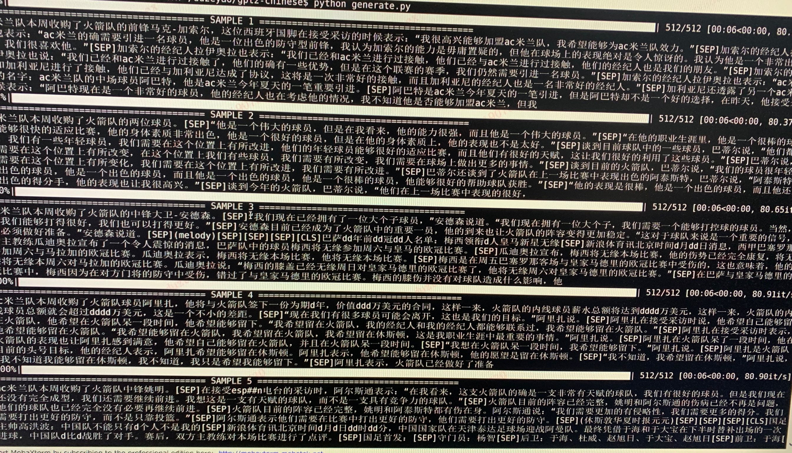
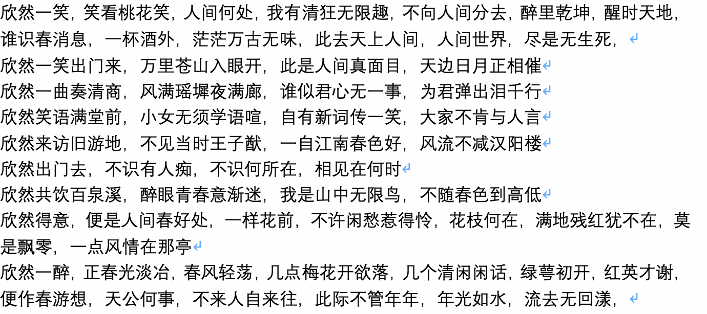
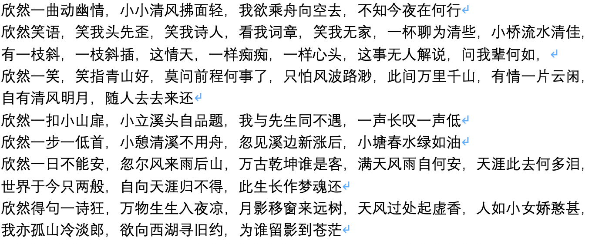

# GPT2-Chinese

## UPDATE Jul 27

- 为了保持项目的干净整洁，我做了一次更新清理。27日之前的内容以及训练斗破苍穹的脚本可以查看old_jul_27的Branch。

## 项目状态

- 目前项目处于积极开发状态，但是主要架构已经稳定。如发现任何bug或是有功能意见与改进欢迎提交Issue，PR或是联系作者。

## 使用方法

- 在项目根目录建立data文件夹。将训练语料以train.json为名放入data目录中。train.json里是一个json，json是一个列表，列表的每个元素都分别是一篇要训练的文章。
- 运行train.py文件，会自动预处理数据。
- 预处理完成之后，将train.py文件内的raw改成False，然后运行，即可开始训练。

## 文件结构

- generate.py 与 train.py 分别是生成与训练的脚本，使用pytorch-transformers库。
- cache/vocab_small.txt 与 config/model_config_small.json 是我目前试验性缩小Bert tokenizer词表大小从而缩小模型大小的产物，两者组合可以在四张2080ti上实现12的batch size。
- train.json 是训练样本的格式范例，可供参考。
- train_single.py 是 train.py的延伸，可以用于一个很大的单独元素列表（如训练一本书）。
- generate_texts.py 是 generate.py 的延伸，可以以一个列表的起始关键词分别生成若干个句子并输出到文件中。

## 注意

- pytorch-pretrained-bert现在已经改名为pytorch-transformers了，我已经将train.py更新，适应新的版本，旧版本的train.py更名为train_old.py，不再更新。
- 模型因商业原因无法公布，需自行运算。各位如果完成了预训练的话欢迎进行交流。
- 如果你的内存非常大或者语料较小的话，可以改掉train.py内build files内的对应代码，不做拆分直接预处理语料。
- 
## 语料

- 可以从[这里](https://github.com/brightmart/nlp_chinese_corpus)与[这里](http://thuctc.thunlp.org/#获取链接)下载。
- 斗破苍穹语料可以从[这里](https://github.com/GaoPeng97/transformer-xl-chinese/tree/master/data/doupo)下载。

## FP16与Gradient Accumulation支持

- 我在train.py文件中加入了fp16与gradient accumulation支持，如果你安装了apex并且知道fp16是什么的话，可以修改变量fp16=True来启用。

## 联系作者

- QQ：330501241
- Mail：ned1991@gmail.com
 
## 生成样例

- 下为斗破苍穹的生成样例，使用约50M参数的GPT2以32Batch Size在16MB斗破苍穹小说内容上训练得到。此处[SEP]表示换行。


- 下为体育新闻的生成样例，使用约50M参数的GPT2以12Batch Size在约300MB体育新闻内容上训练得到。此处[SEP]表示换行，[CLS]表示新的文章，d表示数字。



- 下为古诗的生成样例，在约180MB古诗内容上训练得到。





## Citing

```
@misc{GPT2-Chinese,
  author = {Zeyao Du},
  title = {GPT2-Chinese: Tools for training GPT2 model in Chinese language},
  year = {2019},
  publisher = {GitHub},
  journal = {GitHub repository},
  howpublished = {\url{https://github.com/Morizeyao/GPT2-Chinese}},
}
```
